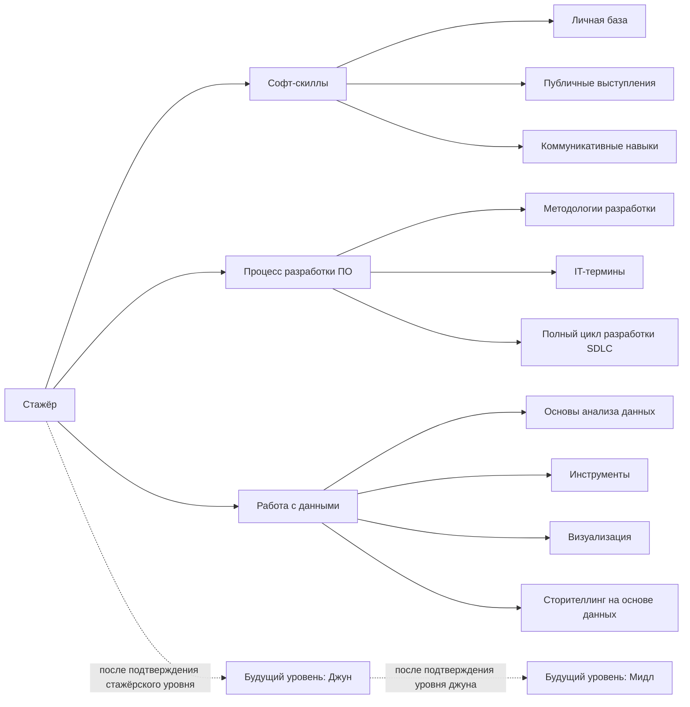

# Карта требований уровня «Стажёр»

Статус: **инвентаризация требований; это не программа и не порядок уроков**.

Источник структуры: раздел «Стажёр» публичной доски Roadmap БА 2026 (`SRC-0001`). Текстовые объекты уровня стажёра занимают участок доски до метки «Джун»; граница проверена 31 августа 2026 года через текстовый обзор Miro. Названия ниже сохранены максимально близко к доске. Опечатки исходной карты исправлены только для читаемости.

## Как читать карту

- **Тема** — что стажёр должен изучить.
- **Рабочий результат** — что он должен суметь сделать, а не просто узнать термин.
- **Источник** — будет добавляться отдельно и проходить аудит.
- **Собеседование** — как знание может быть проверено вопросом или мини-кейсом.
- Наличие пункта здесь не означает, что навык уже освоен.
- Эта карта не определяет недели, уроки и длительность обучения.

## Блок-схема

Сначала подтверждается «Стажёр», затем проектируется «Джун», затем «Мидл». Содержание двух следующих уровней сейчас не разрабатывается.

## 1. Софт-скиллы

### 1.1. Личная база

- Английский.
- Критическое мышление.
- Умение грамотно и чётко излагать свои мысли устно и письменно.
- Умение гуглить и задавать вопросы.

### 1.2. Публичные выступления

- Самопрезентация.
- Проведение встреч.

### 1.3. Коммуникативные навыки

- Переговоры.
- Выстраивание отношений.
  - Стейкхолдеры.
    - Матрица стейкхолдеров.
    - Внутренние и внешние стейкхолдеры.
    - Прямые и косвенные стейкхолдеры.
  - Команда.
    - Технические специалисты:
      - тимлид;
      - системные аналитики;
      - разработчики: фронтенд- и бэкенд-разработчики;
      - тестировщики.
    - Нетехнические специалисты:
      - проектный менеджер (PM);
      - бизнес-аналитики — коллеги;
      - дизайнеры;
      - аналитики данных.
- Конфликтология.

## 2. Процесс разработки ПО

### 2.1. Методологии разработки ПО

- Agile.
- Scrum.
- Kanban.
- Waterfall.

### 2.2. IT-термины

Отдельный словарь терминов, необходимых для понимания разговоров команды разработки. Его точный состав будет сформирован после аудита приложенных к доске источников и текущих требований вакансий.

### 2.3. Полный цикл разработки — SDLC

- Сопровождение процесса разработки.
  - Jira.
    - Инициатива → эпик → пользовательская история → задача.
  - Project management.
- Внедрение в продакшен.
  - Digital adoption.
  - Поддержка.
  - Сбор обратной связи.

## 3. Работа с данными

### 3.1. Основы анализа данных

- Статистика.
- Очистка и подготовка данных — ETL.
- Источники данных и методы сбора данных.

### 3.2. Инструменты

Excel / Google Sheets:

- сводная таблица;
- функция ВПР;
- логические функции;
- сортировка и фильтрация.

SQL:

- подзапросы;
- фильтрация и сортировка;
- манипуляции данными;
- агрегация;
- соединения `INNER`, `LEFT`, `RIGHT`.

### 3.3. Визуализация

- Дашборды.
  - Power BI.
  - Tableau.
- Диаграммы и графики.
  - диаграмма рассеяния;
  - тепловая карта;
  - гистограмма;
  - линейный график;
  - круговая диаграмма.

### 3.4. Сторителлинг на основе данных

- Отчёты и презентации.

## 4. Что стажёру нужно понимать к собеседованию

На самой доске отдельно отмечено, что новичков часто спрашивают:

- чем бизнес-аналитик отличается от системного, продуктового, BI- и дата-аналитика;
- чем продуктовая разработка отличается от проектной;
- чем аутсорс отличается от аутстаффа;
- почему обязанности бизнес-аналитика могут заметно различаться в разных компаниях.

Дополнительно стажёр должен быть готов:

- представиться и простыми словами объяснить роль бизнес-аналитика;
- рассказать, как он ищет информацию и уточняет непонятное;
- разобрать небольшой кейс, отделяя факт от догадки;
- объяснить роли участников IT-команды;
- назвать основные этапы SDLC и место аналитика в них;
- сравнить Agile, Scrum, Kanban и Waterfall без заученных лозунгов;
- показать базовую работу в Excel / Google Sheets и SQL;
- выбрать подходящий вид графика и объяснить вывод;
- рассказать, как подготовит и проведёт рабочую встречу.

Это пока **карта проверки**, а не готовый банк вопросов. Текущие требования российского рынка будут исследованы отдельно по вакансиям стажёров и начинающих бизнес-аналитиков.

## 5. Рабочие обязанности стажёра: первая рыночная проверка

Это не дословная ветка Miro. Раздел проверен по официальной архивной вакансии стажёра Яндекс 360 (`SRC-0006`) и по странице профессии и найма бизнес-аналитиков Т-Банка (`SRC-0007`). Общая часть обязанностей выглядит так:

- искать, структурировать и проверять информацию;
- превращать результаты работы и мысли в понятный текст;
- готовить внутренние материалы о процессах;
- работать с трекером задач, метриками и небольшими выгрузками данных;
- поддерживать базу знаний, описания процессов и инструкции;
- общаться со смежными командами, заказчиками и другими заинтересованными сторонами;
- помогать собирать и уточнять требования;
- участвовать в моделировании процессов и подготовке вариантов улучшения;
- готовить простые отчёты и презентации;
- выполнять работу под руководством наставника и доводить согласованные задачи до результата.

Важно: набор обязанностей зависит от компании. Например, в Яндекс 360 стажёрская роль была сильнее связана с внутренними коммуникациями, трекером и базой знаний, а профиль Т-Банка объединяет бизнес-анализ с элементами системного, продуктового анализа и управления проектом. Поэтому окончательный список будет составлен по выборке вакансий, а не по одному работодателю.

## 6. Карточка каждого пункта

Для каждого узла карты будет создана строка в `research/INTERN-SOURCE-INTAKE.md` со следующими полями:

1. точное название темы;
2. что стажёр должен объяснить;
3. что стажёр должен сделать самостоятельно;
4. предоставленные учеником источники;
5. дополнительные найденные источники;
6. состояние проверки каждого источника;
7. типичный вопрос или задание на собеседовании;
8. доказательство освоения;
9. найденные пробелы и противоречия.

## 7. Граница текущего этапа

Сейчас мы фиксируем требования «Стажёра», собираем и проверяем источники, уточняем обязанности и собеседования по реальному рынку. Мы не строим уроки и недели, не распределяем часы и не разрабатываем уровни «Джун» и «Мидл».

К проектированию обучения до 1 января 2027 года переходим только после заполнения карты и библиотеки источников, исследования архитектур онлайн-обучения и отдельного обсуждения форматов теории и практики.
